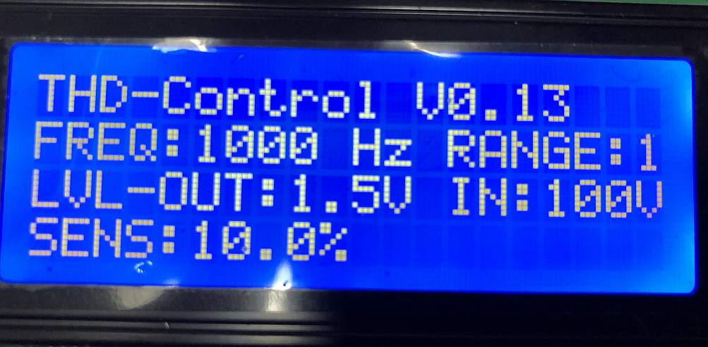

# Bob Cordell's THD Analyzer
Bob Cordell created a series of articles in Audio Magazine, from July to September 1981 (!). In these articles, he described
in detail how to build a Total Harmonic Distortion (THD) Analyzer. I first heard of Bob Cordell, when I bought his book called "Designing Audio Power Amplifiers". 
I have never seen such an excellent written book about designing audio power amplifiers before, especially the first few chapters on continually improving a basic design 
to a high-end audio amplifier impressed me. I used the knowledge gained from his book as a base for teaching analog electronics for 3rd grade students Electrical Engineering.

I was also deeply impressed by the wealth of information in these articles and decided to build such a THD Analyzer myself. Bob
used some custom made switches with lots of decks to do the actual switching. Over the years I managed to find and construct these
switches, made some custom PCBs, created a nice front-end display and had my way of creating an implementation. As of today, this is
still work in progress.

Meanwhile, I decided to build another version of this THD Analyzer, which you will find on this page. It is the same
THD Analyzer, but now controlled by relays and a STM8S105C6 microcontroller. Such an implementation was discussed on the diyaudio forum
where someone called Giulianodes created another version where you would still need switches, but most switching was now done by relays.

His PCBs were very helpful in constructing this version of the THD Analyzer. Most ideas here are not mine, but originated from Bob Cordell
and from Giulianodes' PCB implementation.

I wanted to construct a THD Analyzer that was completely digital, while maintaining the original quality from Bob's design. 
I wanted 7-segment displays (SSD) for voltages, frequency and distortion (instead of an analog meter).
I also wanted to control all settings with keys and a LCD-display. I wanted an UART interface with commands, so I could do unit-testing of the boards.
And switching of all resistors and capacitors should also be done by relays. To conveniently read values from the SSDs, I also added LEDs for Hz or kHz, dB or % and Vpeak or Vrms.

In the end, I created five PCBs, one for each original PCB from Bob, one for the power-supply and one for the microcontroller itself. They are connected with flat-cable connectors.
Every PCB has the original analog design from Bob together with added relays. These relays are controlled by shift-registers, so off-board IO is very limited.
The microcontroller controls the shift-registers on every board and thus every single relay on these boards.

I decided to use the G6K-2F-Y relay for a few reasons: they are small, they are cheap and they are readily available (30 pcs for €26 on AliExpress). I also used the +12V
version, because current is limited (9.1 mA) and +12V can be made from the existing +15V DC. There are two switches present in every relay, which is very convenient.

 
*LCD-Display showing actual settings*

# Features
The current PCB and firmware have the following features:
- Four 7-Segment-Displays displaying 1) Output Level, in RMS or peak voltage 2) Display of actual frequency, measured by the microcontroller 3) Distortion level in dB or as a percentage 4) Input Level in RMS or peak voltage
- LCD display displaying actual settings
- Five buttons UP, DOWN, LEFT, RIGHT and OK for changing settings such as Frequency, output-level, input-level and sensitivity.
- Main output, Sync Output, Input and Distortion Output (same as in original design)
- Level Output potmeter (same as in original design)
- Four LEDs showing frequency too high/too low and input level too high/too low (same as in original design)
- All components are SMD where possible.

 
*Block-Diagram THD-Analyzer*

# PCB 1: Signal Generator
This was the Signal Source PCB1 from Bob's original design. Design details and engineering design files (schematics, PCB-layout, Gerber-files) are found on the [PCB1](./pcb1.md) page.

# PCB 2: Bandpass Filters and Product Amplifier and Level Set

PCB2 contained the voltage controlled bandpass-filters and the product-amplifiers. Design details and engineering design files (schematics, PCB-layout, Gerber-files) are found on the [PCB2](./pcb2.md) page.

# PCB 3: Amplitude and Frequency Detectors and Filter and Meter circuits

PCB3 contained the Amplitude and Frequency detectors and the Filter and Meter circuits. Design details and engineering design files (schematics, PCB-layout) are found on the [PCB3](./pcb3.md) page.

# PCB 4: Microcontroller PCB
This is a newly designed PCB and was not in Bob's original design. It contains a SMT8S105 microcontroller and it is the control unit for the entire project. This board uses flat-cables to send and receive all signals from PCB1 to PCB3.

I chose the STM8S105, because I have substantial experience with these devices and they are easy to get operational, both hardware and software (especially if you have a large code-base of other projects available). The 8-bit core runs on 16 MHz and is 
powerful enough to control this project. It also has sufficient IO (I use the LQPF-48 package) for what I needed.

Design details (source-code structure, description of user-interface) and engineering design files (schematics, PCB-layout) are found on the [PCB4](./pcb4.md) page.

# PCB 5: Power-Supply
This is a newly designed PCB by bengtssk, who did a wonderful job creating a low-noise power-supply for all boards of this project.

Design details and engineering design files (schematics, PCB-layout) are found on the [PCB5](./pcb5.md) page.

