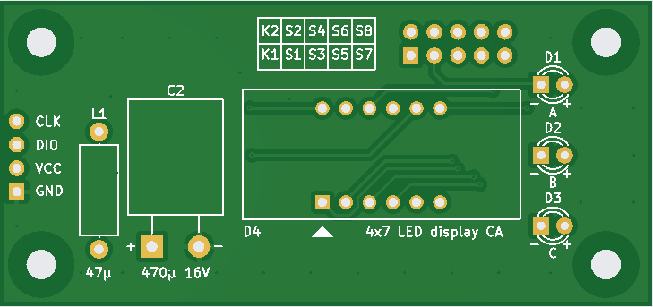
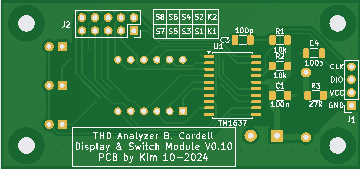

# SSD modules for displays and key scan
 
*SSD PCB front layer*

 
*SSD PCB back layer*

The PCB was created using KiCad v8.0. It is a double sided PCB with a 4 digit 7-segment LED display at the front and TM1637 IC at the back. A ground-plane is used to minimize EMI transmissions from the board. Connectors J1 and J2 can be mounted on either side, depending what is most convenient. Same for the 470 µF cap, if you use a low-voltage radial cap and lay it down, it even has lower height than a SMD cap.

# SSD module Schematic
[SSD module schematic](img/SSD_schematic.pdf) 
*SSD module schematic*

# Design-details
In the beginning of this project it was discovered that the SSD modules caused switching spikes at the +5V rail from the multiplexing of the LED displays. These voltages spikes did not only cause the frequency counter to malfunction, but also increased the residual distortion, making the whole instrument useless.

The original SSD modules from Ali-Express comes with only 2 µF decoupling for the TM1637 IC, while the datasheet suggests 100 µF. But even that is too low. Instead of just a capacitor, a LC-filter was added to each SSD module with good results. In order to minimize EMI being transmitted from the board or its power cables, the filter should be placed as close to the TM1637 as possible. A new PCB was designed for this purpose.

Component values of the LC filter are not very critical, the values were determined by experiment. The series resistor improves the performance significantly.

Indicator LEDs for Hz, kHz etc. are now included on the board (LED A, B and C) and controlled by the TM1637 as well. Note that some boards only use LED's A and C. In this case do not populate LED B.

Since the TM1637 also features a key scan option, connector J2 was added for connecting keys. See the [Keys](./pcb4.md#Keys) section in [PCB4](./pcb4.md) on how to connect keys to this connector.

# Gerbers
This zip-file contains Gerbers to be sent for manufacturing:  [SSD Gerber Files](img/SSD-gerbers.zip)
