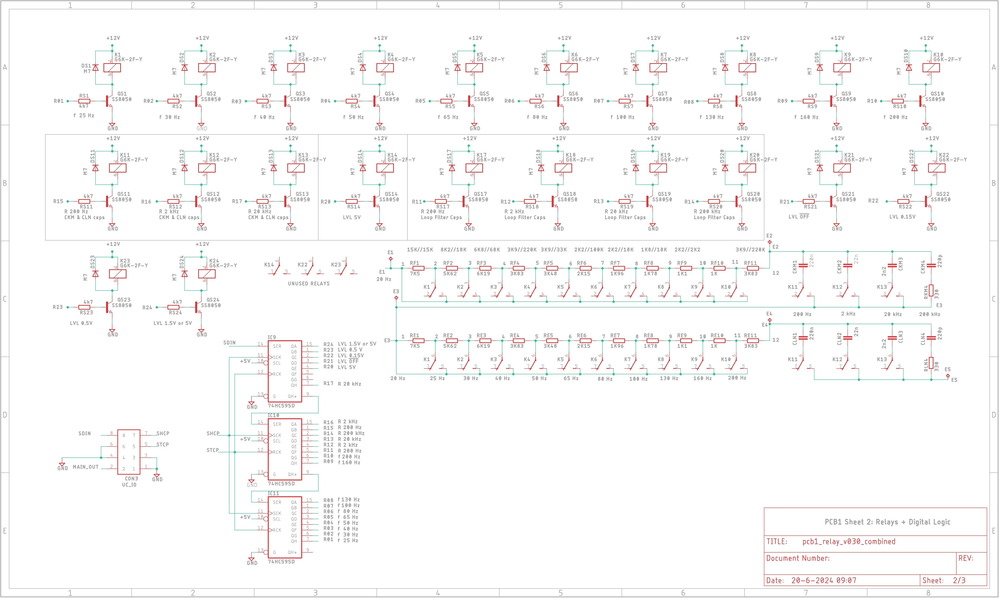

# PCB2 Engineering Design Files
The PCBs were created with Eagle v9.3.2.

The schematics consists of three sheets:
- Sheet 1: the signal generator
- Sheet 2: the relays and the digital logic
- Sheet 3: the power-supply

 
*PCB1 Sheet 1: signal generator*

 
*PCB1 Sheet 2: relays and digital logic*

 
*PCB1 Sheet 3: power-supply*

The PCB itself is a double layer PCB with most components being SMD. Only a few capacitors, specified by Bob as being silver-mica or polyester, are through-hole.

 
*PCB1 Top-layer Layout*

# Gerber-Files
Gerber-files will be placed here when they become available. These are the production-files that can be sent to a PCB-manufacturer. I typically use JLCPCB.

