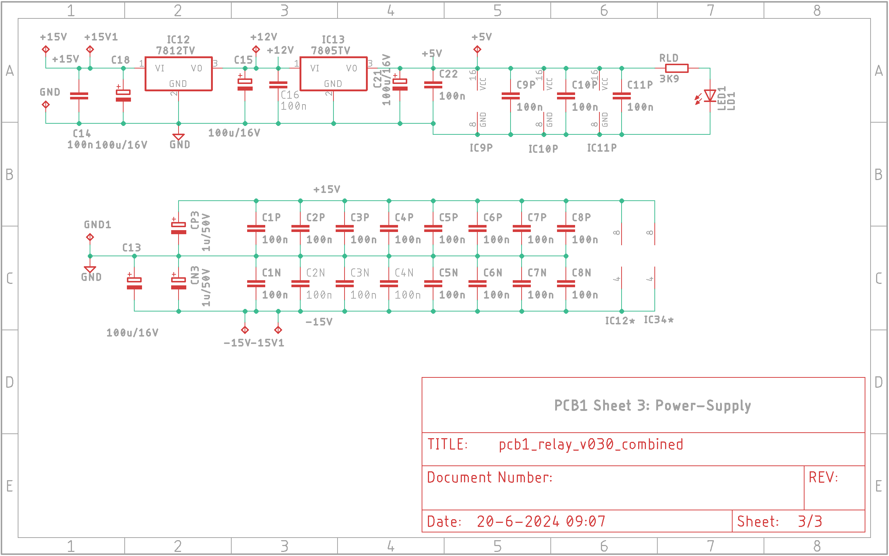

# PCB1 Top-layer layout
 
*PCB1 Top-layer Layout*

The PCBs were created with Eagle v9.3.2. The PCB itself is a double layer PCB with most components being SMD. Only a few capacitors, specified by Bob as being silver-mica or polyester, are through-hole.

# PCB1 Schematics
The schematics consists of three sheets:
- Sheet 1: the signal generator
- Sheet 2: the relays and the digital logic
- Sheet 3: the power-supply

 
*PCB1 Sheet 1: signal generator*

 
*PCB1 Sheet 2: relays and digital logic*

 
*PCB1 Sheet 3: power-supply*

# Design-details
I named the bits from the HC595 shift-registers R01-R24 (R15 and R16 are not connected), with R01 being the first bit to shift into the shift-registers. They have the following meaning:
- R01: f=25 Hz to R10: f=200 Hz. For f=20 Hz all bits (R01-R10) need to be 0.
- R11: Range = 200 Hz, R12: Range = 2 kHz, R13: Range is 20 kHz. R14: Range is 200 kHz.
- PCB1 V0.30 only: R15: Range = 200 Hz, R16: Range = 2 kHz, R17: Range is 20 kHz.
- PCB1 V0.21 only: R15 until R19: these bits are not used.
- PCB1 V0.30 only: R18 and R19 are not used.
- R20: Output Level is 5 V.
- R21: Output Level if not OFF.
- R22: Output Level is 0.15 V.
- R23: Output Level is 0.5 V.
- R24: Output Level is 1.5 V or 5 V.

The MAIN.OUT signal is also sent to the microcontroller (via CON3) for both frequency and level measurement.

# SYNC MOD
This modification applies to PCB1 v0.30. The frequency-counter (a software function) gets its signal from an amplified sine-wave. This does work, but reliability is higher when the SYNC signal is used for this. The SYNC signal comes from this PCB and is sent to the uC PCB (PCB4) via CON3.

For PCB1, do the following:
- Desolder CON3 (UC_IO) box-header
- Use a sharp knife to disconnect pin 1 (bottom right pin as seen from top-layer) from GND on top-layer. There are 3 connections to GND, remove all three of them.
- Same for the 3 connections to GND on the bottom-layer.
- Check for discontinuity between GND and CON3-1 pin.
- Solder CON3 box-header back.
- Solder wire from CON1-SYNC pin to CON3-1.
- Check for discontinuity between GND and CON3-1 pin.
- In order for this mod to work, check the SYNC MOD paragraph on PCB4 too.

# PCB1 Unit-testing
Bob describes some bench-testing in his article. Since the PCB is now tested slightly different from Bob's original article, I created unit-test documents that use the microcontroller board (PCB4). This unit-test facilitates testing of PCB1. I have added both the unit-test document itself as well as a filled-in version of a test I performed. This is a good reference if you do your own unit-testing.

[PCB1 Unit-Test description](img/PCB1_Unit_Test.pdf) 

[PCB1 Unit-Test description filled-in](img/PCB1_Unit_Test_filled_in.pdf) 

In order to test this, a working PCB4 (µC control board) is needed. PCB4 should be connected to a host-PC with an USB-to-UART adapter, communication settings are 57600,N,8,1. See the [PCB4](./pcb4.md) page for details.

# Eagle source-files
Not to be used for commercial purposes!
This is the .zip file containing the Eagle source-files: [PCB1 Eagle Files](img/PCB1_Eagle.zip)

# Gerber-Files
This is the .zip file containing the Gerber files that were sent to JLCPCB: [PCB1 Gerber Files](img/pcb1_relay_v030_combined_2024-07-10.zip)

