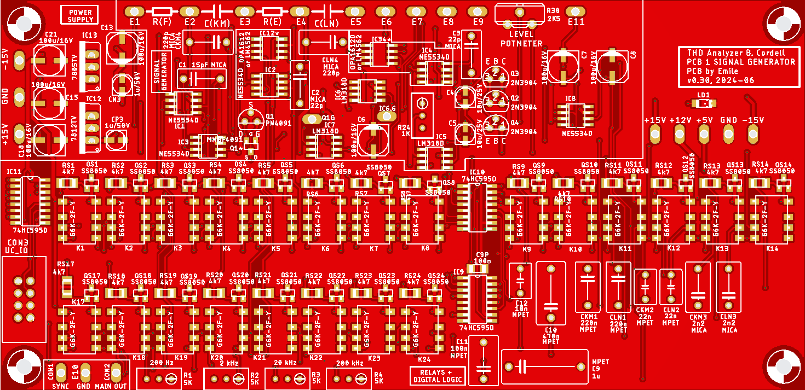

# PCB1 Top-layer layout
 
*PCB1 Top-layer Layout*

The PCBs were created with Eagle v9.3.2. The PCB itself is a double layer PCB with most components being SMD. Only a few capacitors, specified by Bob as being silver-mica or polyester, are through-hole.

# PCB1 Schematics
The schematics consists of three sheets:
- Sheet 1: the signal generator
- Sheet 2: the relays and the digital logic
- Sheet 3: the power-supply

 
*PCB1 Sheet 1: signal generator*

 
*PCB1 Sheet 2: relays and digital logic*

 
*PCB1 Sheet 3: power-supply*

# Design-details
I named the bits from the HC595 shift-registers R01-R24 (R15 and R16 are not connected), with R01 being the first bit to shift into the shift-registers. They have the following meaning:
- R01: f=25 Hz to R10: f=200 Hz. For f=20 Hz all bits need to be 0.
- R11: Range = 200 Hz, R12: Range = 2 kHz, R13: Range is 20 kHz. For Range = 200 kHz these bits are all 0.
- R12 until R19: these bits are not used.
- R20: Output Level is 5 V.
- R21: Output Level if not OFF.
- R22: Output Level is 0.15 V.
- R23: Output Level is 0.5 V.
- R24: Output Level is 1.5 V or 5 V.

The MAIN.OUT signal is also sent to the microcontroller (via CON3) for both frequency and level measurement.

# Gerber-Files
This is the .zip file containing the Gerber files that were sent to JLCPCB: 

