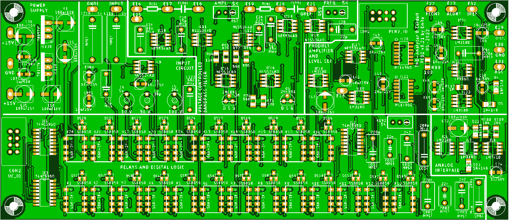
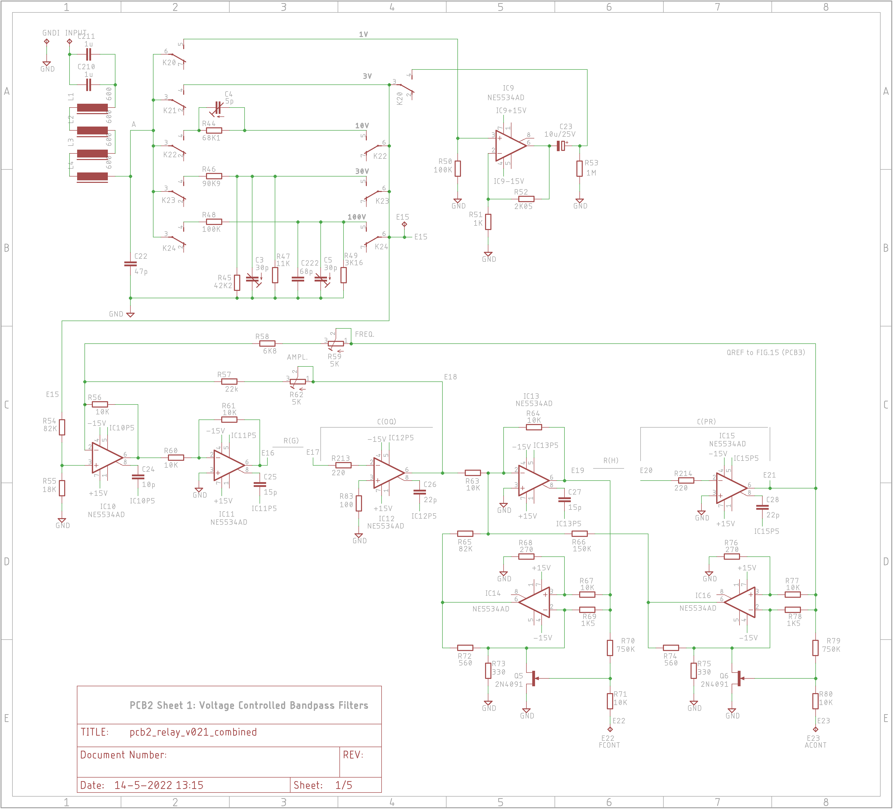
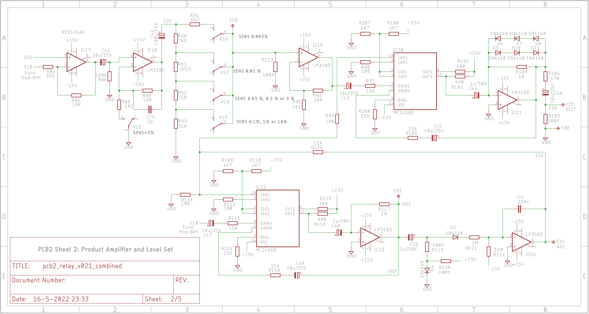
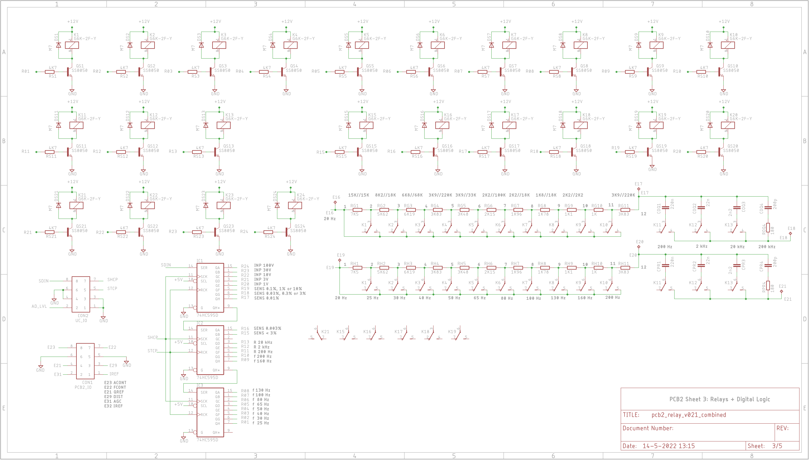
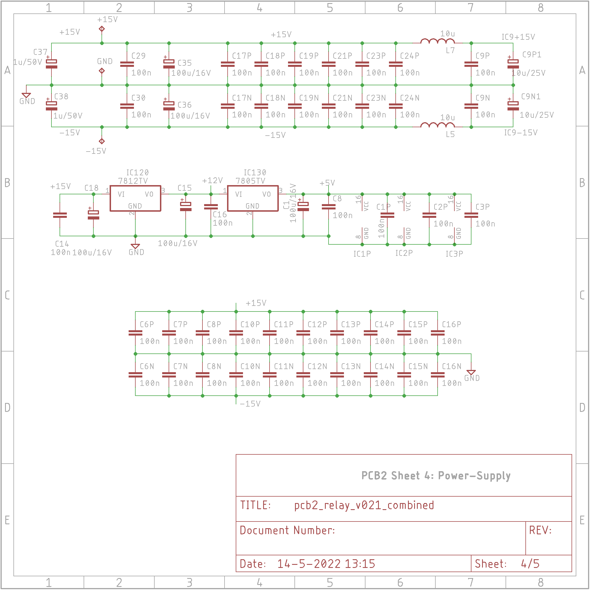
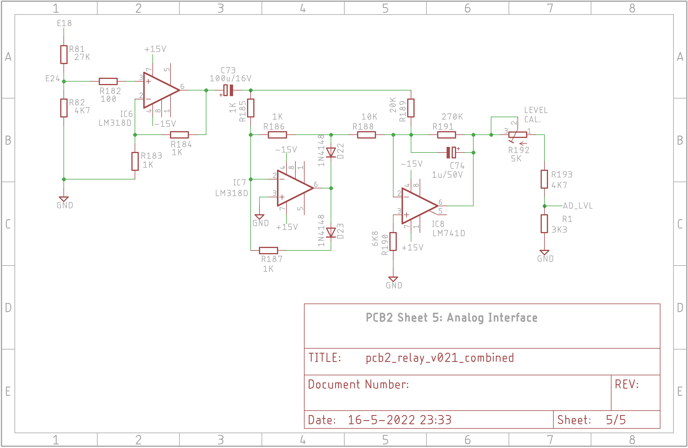

# PCB2 Engineering Design Files
 
*PCB2 Top-layer Layout*

The PCBs were created with Eagle v9.3.2. The PCB itself is a double layer PCB with most components being SMD. Only a few capacitors, specified by Bob as being silver-mica or polyester, are through-hole.

# PCB2 Schematics
The schematics consists of five sheets:
- Sheet 1: the voltage controlled bandpass-filters
- Sheet 2: the product-amplifiers and level set
- Sheet 3: the relays and the digital logic
- Sheet 4: the power-supply
- Sheet 5: the analog interface

 
*PCB2 Sheet 1: voltage controlled bandpass filters*

 
*PCB2 Sheet 2: product-amplifiers and level set*

 
*PCB2 Sheet 3: relays and digital logic*

 
*PCB2 Sheet 4: power-supply*

 
*PCB2 Sheet 5: analog interface*

The PCB itself is a double layer PCB with most components being SMD. Only a few capacitors, specified by Bob as being silver-mica or polyester, are through-hole.

# Design-details
I named the bits from the HC595 shift-registers R01-R24, with R01 being the first bit to shift into the shift-registers. They have the following meaning:
- R01: f=25 Hz to R10: f=200 Hz. For f=20 Hz all bits need to be 0.
- R11: Range = 200 Hz, R12: Range = 2 kHz, R13: Range is 20 kHz. For Range = 200 kHz these bits are all 0.
- R14: This bit is not used.
- R15: Sensitivity < 3 %. This replaces the function of switch S5B
- R16: Sensitivity is 0.003 %.
- R17: Sensitivity is 0.01 %.
- R18: Sensitivity is 0.03 %, 0.3 % or 3 %.
- R19: Sensitivity is 0.1 %, 1 % or 10 %. Together with R16, R17 and R18, they replace the function of switch S5A.
- R20: Input level is 1 V.
- R21: Input level is 3 V.
- R22: Input level is 10 V.
- R23: Input level is 30 V.
- R24: Input level is 100 V. Together with R20, R21, R22 and R23, they replace the function of switch S4A and S4B.

Connector CON2 is used as interface to the microcontroller board. It contains the MAIN.OUT signal and the signals for the shift-registers (SDIN, SHCP and STCP).

PCB2 also contains connector CON1. This is used as an interface to/from PCB3. It contains the following signals: FCONT (E22), ACONT (E23), E21 (QREF), E29 (DIST), E31 (AGC) and E32 (IREF).

# Gerber-Files
This is the .zip file containing the Gerber files that were sent to JLCPCB: 

