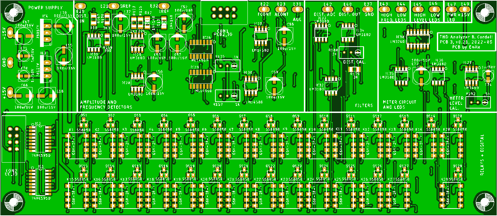

# PCB3 Engineering Design Files
The PCBs were created with Eagle v9.3.2.

The schematics consists of five sheets:
- Sheet 1: the amplitude and frequency detectors
- Sheet 2: the meter and LED interface
- Sheet 3: the relays and the digital logic
- Sheet 4: the filter-circuit
- Sheet 5: the power-supply

 
*PCB3 Sheet 1: amplitude and frequency detectors*

 
*PCB3 Sheet 2: meter and LED interface*

 
*PCB3 Sheet 3: relays and digital logic*

 
*PCB3 Sheet 4: Filter-circuit*

 
*PCB3 Sheet 5: power-supply*

The PCB itself is a double layer PCB with most components being SMD. Only a few capacitors, specified by Bob as being silver-mica or polyester, are through-hole.

 
*PCB3 Top-layer Layout*

#Gerber-Files
Gerber-files will be placed here when they become available. These are the production-files that can be sent to a PCB-manufacturer. I typically use JLCPCB.

