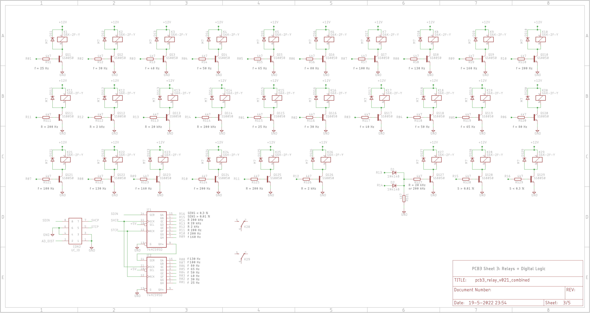

# PCB3 Engineering Design Files
 
*PCB3 Top-layer Layout*

The PCBs were created with Eagle v9.3.2. The PCB itself is a double layer PCB with most components being SMD. Only a few capacitors, specified by Bob as being silver-mica or polyester, are through-hole.

# PCB3 Schematics
The schematics consists of five sheets:
- Sheet 1: the amplitude and frequency detectors
- Sheet 2: the meter and LED interface
- Sheet 3: the relays and the digital logic
- Sheet 4: the filter-circuit
- Sheet 5: the power-supply

 
*PCB3 Sheet 1: amplitude and frequency detectors*

 
*PCB3 Sheet 2: meter and LED interface*

 
*PCB3 Sheet 3: relays and digital logic*

 
*PCB3 Sheet 4: Filter-circuit*

 
*PCB3 Sheet 5: power-supply*

# Design-details
I named the bits from the HC595 shift-registers R01-R16, with R01 being the first bit to shift into the shift-registers. They have the following meaning:
- R01: f=25 Hz to R10: f=200 Hz. For f=20 Hz all bits need to be 0.
- R11: Range = 200 Hz, R12: Range = 2 kHz, R13: Range is 20 kHz, R14: Range is 200 kHz.
- R15: Sensitivity > 0.01 %. This replaces switch S5C.
- R16: Sensitivity < 0.3 %. This replaces switch S5D.

Because of the filters, there's substantial switching of resistors and capacitors. So most shift-register bits are sent to multiple relays. For example: Bit R04 (f = 50 Hz) controls both relay K4 and K18. Every relays switches 2 resistors.

# Unit-Test (CP3 Bench-test)
Bob describes some bench-testing in his article. Since the PCB is now tested slightly different from Bob's original article, I created unit-test documents that use the microcontroller board (PCB4). This unit-test facilitates testing of PCB3. I have added both the unit-test document itself as well as a filled-in version of a test I performed. This is a good reference if you do your own unit-testing.

 

 

# Eagle source-files
Not to be used for commercial purposes!
This is the .zip file containing the Eagle source-files: [PCB3 Eagle Files](img/PCB3_Eagle.zip)

# Gerber-Files
This is the .zip file containing the Gerber files that were sent to JLCPCB: [PCB3 Gerber Files](img/pcb3_relay_v021_combined_2022-05-20.zip)

