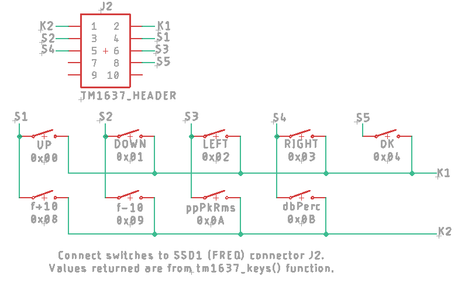

# PCB4 Engineering Design Files
 
*PCB4 Top-layer Layout*

The PCBs were created with Eagle v9.3.2.

# PCB4 Schematics
 
*PCB4 microcontroller Control-Board Schematics*

The PCB itself is a double layer PCB with most components being SMD. Some details:
- CON1, CON2, CON3 and CON4 are screw terminal-blocks for the Seven Segment Displays (SSD). CON1 shows the selected frequency, CON2 the selected output level (OFF, 0.15V, 0.5V, 1.5V and 5V), CON3 the selected distortion level (0.003%, 0.01%, 0.03%, 0.1%, 0.3%, 1%, 3% and 10%) and CON4 the selected input level (1V, 3V, 10V, 30V and 100V).
- CON5 is also a screw terminal-block, but for the I2C LCD-Display.
- CON6 is the UART interface. Note that signal levels are 5 V.
- CON7 is the JTAG programming interface, that needs to be connected to an ST-Link V2 USB adapter (see below) in order to program the microcontroller.
- CON8 contains the input key connections.
- CON9 contains all LED connections for the front-panel.
- CON10, CON11 and CON12 are flat-cable connectors that interface with PCB1, PCB2 and PCB3 respectively. They contain the signals for the shift-registers and the analog signals MAIN.OUT, DIST and LEVEL.

# Design-details
This PCB more or less copies the full-wave precision rectifier as found on PCB3. I wanted to have the MAIN.OUT signal from PCB1 measured in both amplitude and frequency. The amplitude is rectified to a DC-level and sent to ADC1, the
frequency is measured by amplifying the sine-wave into a square-wave and then send it to a timer-input (TIM1_CH1) to capture the period-time.

# SYNC MOD
This modification applies to PCB4 v0.20. The frequency-counter (a software function) gets its signal from an amplified sine-wave. This does work, but reliability is higher when the SYNC signal is used for this. The SYNC signal comes from PCB1 (and needs a modification too!) via CON3.

For PCB4, do the following:
- Desolder IC4 pin 14 from its pad and lift it up.
- Solder a wire from CON10-1 (bottom right pin as seen from top-layer, pin next to AD_MAIN pin) to R33 pad next to R32. R32 and R33 are located next to each other, solder the wire to one of the pads in the middle.
- In order for this mod to work, check the SYNC MOD paragraph on PCB1 too.

### GPIO
The GPIO pin lay-out as shown in the schematic is copied in the header-file stm8_hw_init.h and used throughout the project. GPIO pins are initialized in the function setup_gpio_ports() in stm8_hw_init.c.

### Peripherals
I decided not to use the internal I2C module, since it is overly complicated and troublesome to get to work. Good old bit-banging is used instead, see files i2c_bb.c and i2c_bb.h. The ADC (adc.c, adc.h), eeprom (eep.c, eep.h) and UART (uart.c, uart.h) routines are pretty standard.

The UART commands are defined in comms.c/comms.h in the function execute_single_command(). The UART functions itself are interrupt-driven and they use ringbuffers to store and retrieve communication.

### UART communications
- Use PCB4 connector 6 (CON6, RS232.5V) for serial communications to a host-PC.
- Communication settings are 57600 Baud, no parity, 8 bits, 1 stop-bit (57600,N,8,1).
- Use an USB-to-UART adapter and connect the following signals: GND to CON6_GND, TXD to CON6_RX and RDX to CON6_TX. In Windows a virtual COM port is added to the device list when this adapter is added.
- CON6 uses 5V levels, so set the USB-to-serial adapter to accept 5 Volt levels.
- Use Realterm (or any other communication program) on the host-PC for sending and receiving data to/from PCB4. Make sure that a CR and a LF are added to the command-string when sending.
- Make sure that you get a USB-to-UART adapter and not an USB-to-RS232 adapter, because voltage-levels are 0-5 Volt only (RS232 is typical +6V and -6V and will not work with CON6).

To test communications, enter the command 's0', make sure that CR and LF are sent as well and send it to the PCB4 control-board. Typically it should respond with a string like 'THD-Control V0.25'. Besides s0, the following commands are also available:
- c0 or c0 <float> with <float> being a floating-point value. The c0 parameter defines the 100 V input-level and is by default set to 32.645570, which is equal to 1+(R48/R49). If you just type c0, the currently stored value is displayed. Change this parameter to get a correct reading of the input-level on SSD3 for the 100V input setting. This value is stored in eeprom, so the value remains set after a power-cycle.
- c1 or c1 <float>: same as c0 but for the 30V input-level reading. Equal to 1+(R46/R47).
- c2 or c2 <float>: same as c0 but for the 10V input-level reading. Equal to 1+(R44/R45).
- c3 or c3 <float>: same as c0 but for the 3V input-level reading. Equal to 1.0, because this is a pass-through.
- c4 or c4 <float>: same as c0 but for the 1V input-level reading. Equal to R51/(R51+R52).
- a0, a1 or a2: set amplitude-level to Vrms (a0), Vpeak (a1) or Vpp (a2).

### Scheduler
Furthermore, the scheduler (scheduler.c, scheduler.h) takes care of proper timing for all tasks. The add_task() routine controls timing of every task and is called from main() in THD_Analyzer_main.c. There are three tasks defined:
- adc_task(), name "ADC", called every 500 msec. This task reads the analog values from the AD-converters and stores the information on the SSDs.
- freq_task(), name "FRQ", called every 200 msec. This task calculates the actual frequency of the generated sine-wave and updates information on the LCD-display.
- ctrl_task(), name "CTL", called every 100 msec. This task reads the input-buttons and runs the state-machine. The state-machine is used to adjust settings.

### Keys
There are five keys that should be connected to CON8 (KEYS) of the uC PCB. These keys are UP, DOWN, LEFT, RIGHT and OK and are used for navigating the menu in the LCD-display.

With the start of firmware revision V0.25, it is also possible to connect these keys to connector J2 of the first TM1637 seven-segment display (the one that shows the actual frequency). Both connectors are read in by the software and if either one of these connectors show a key-press, it is handled as such. 

There are four additional keys on the frontpanel: f+10, f-10, pppkrms and dbperc, they can only be connected to connector J2 of the first TM1637 seven-segment display. They increase (fp10) or decrease (fm10) the frequency in 10-steps, they change the amplitude readings to peak-peak, peak or RMS (pppkrms) or they change the distortion unity to dB or a percentage (dbperc).

The keys should be connected to SSD connector J2 as follows:
 
*How to connect the frontpanel keys*

### LCD-Display
There are separate files (i2c_lcd.c, i2c_lcd.h) for the LCD-display functions. These functions call the actual I2C-routines from i2c_bb.c/i2c_bb.h. The seven-segment display routines are listed in tm1637.c/tm1637.h.

The second, third and fourth line of the LCD-display contain the actual settings (frequency, output-level, input-level and sensitivity). They can be changed with the buttons as follows:
- UP and DOWN button are used to select a higher/lower frequency. There's is no roll-over so trying to select a lower frequency than 20 Hz keeps the frequency at 20 Hz. Same for the 200 kHz setting: trying to select a higher frequency keeps the frequency set at 200 kHz.
- LEFT and RIGHT button are used to select the various settings. The selected setting is shown on the first line of the LCD-display. You can than use the UP and DOWN buttons to change values. A value change is immediate.
- OK button brings up the parameter menu. You can change amplitude (Vpeak or Vrms) and the unit of distortion (dB or percentage). Note that this can also be done directly (from V0.25 onwards) with the keys on the frontpanel. Other parameter changes are to be defined.

### Seven-Segment Displays (SSD)
There are a total of four SSDs present in the system. The first SSD shows the actual frequency and is also used to read in a number of keys. There are separate PCBs created for the SSDs to provide better power-supply decoupling and to add a number of LEDs right next to the display. A connector is also added to connect keys to.

The seven-segment display routines are listed in tm1637.c/tm1637.h.

Bengtssk made a nice PCB for these SSDs, design details are given on the [SSD](./SSD.md) page.

# Eagle source-files
Not to be used for commercial purposes!
This is the .zip file containing the Eagle source-files: [PCB4 Eagle Files](img/PCB4_Eagle.zip)

# Gerber-Files
This is the .zip file containing the Gerber files that were sent to JLCPCB: [PCB4 Gerber Files](img/control_stm8s105c6 v02_2024-07-10.zip)

# Programming the microcontroller
To start with, you'd need one of those fancy coloured ST-Link V2 USB adapters (which are very cheap to find on ebay/Aliexpress). 
 
 
*The ST-Link V2 USB adapter*

Power PCB4 from a ±15V dual power-supply and connect the ST-Link USB adapter without the VCC line (only SWIM, NRST and GND). Now, there are several options to program the microcontroller:

1) Use ST Visual Programmer (STVP-STM8), this can be downloaded for free. A project file for STVP is included [here](./Debug/Exe/THD_Analyzer_stm8s105.stp).

2) Use the opensource tool stm8flash.

3) Use opensource tools Code::Blocks in combination with the SDCC C compiler. A Code::Blocks project file is present (THD_Analyzer_stm8s105.cbp) that loads the entire project. You probably only need to set the SDCC home directory in Settings->Compiler..., then select Small Device C Compiler in the selected compiler field, then click Toolchain executables, then enter the compiler's installation directory and do a 'Auto-detect'. I suggest to install SDCC first and then install Code::Blocks. The toolchain creates a .hex file in Debug\ExeCB which can be uploaded with either stm8flash (preferred for Unix platforms) or STVP (on Windows).

4) Use the IAR development environment for STM8 from the IAR website. A 14-day free trial version is available.
- Open the workspace in IAR (File -> Open -> Workspace... -> THD_Analyzer_stm8s105.eww), then do a Project -> Rebuild All.
- There is a preprocessor define (USE_IAR_HEADER_FILE) that can be defined in Project->Options->C/C++ Compiler. If defined, the standard header file (<iostm8s105.h>) is used. If not defined, the file stm8s105.h is used.
- Press Ctrl-D. This opens the debugger and transfers the code to the microcontroller. 
- Press Ctrl-Shift-D to Stop Debugging. Remove the wires, re-cycle power and you are good to go!

