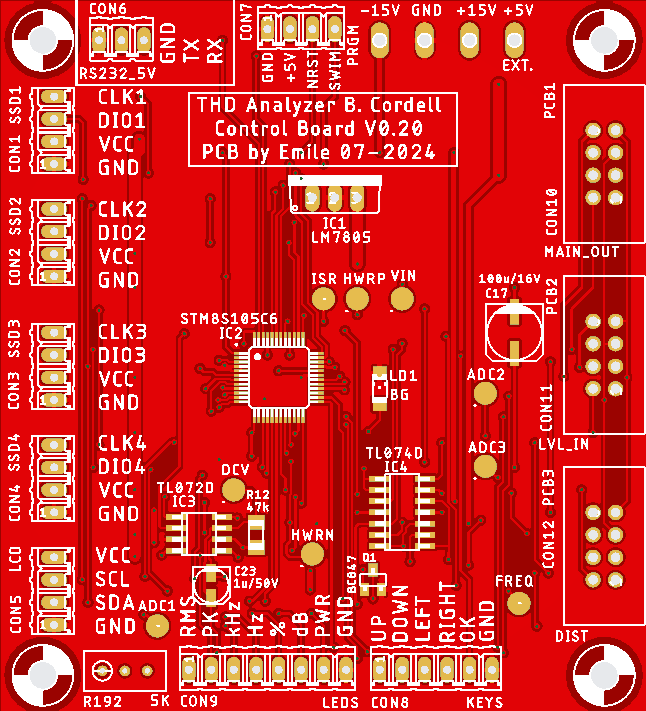

# PCB4 Engineering Design Files
 
*PCB4 Top-layer Layout*

The PCBs were created with Eagle v9.3.2.

# PCB4 Schematics
 
*PCB4 microcontroller Control-Board Schematics*

The PCB itself is a double layer PCB with most components being SMD. Some details:
- CON1, CON2, CON3 and CON4 are screw terminal-blocks for the Seven Segment Displays (SSD).
- CON5 is also a screw terminal-block, but for the I2C LCD-Display.
- CON6 is the UART interface. Note that signal levels are 5 V.
- CON7 is the JTAG programming interface, that needs to be connected to an ST-Link V2 USB adapter (see below) in order to program the microcontroller.
- CON8 contains the input key connections.
- CON9 contains all LED connections for the front-panel.
- CON10, CON11 and CON12 are flat-cable connectors that interface with PCB1, PCB2 and PCB3 respectively. They contain the signals for the shift-registers and the analog signals MAIN.OUT, DIST and LEVEL.

# Design-details
This PCB more or less copies the full-wave precision rectifier as found on PCB3. I wanted to have the MAIN.OUT signal from PCB1 measured in both amplitude and frequency. The amplitude is rectified to a DC-level and sent to ADC1, the
frequency is measured by comparing the positive rectified signal to half the DC-level and then send it to a timer-input (TIM1_CH1) for capture of the period-time.

### GPIO
The GPIO pin lay-out as shown in the schematic is copied in the header-file stm8_hw_init.h and used throughout the project. GPIO pins are initialized in the function setup_gpio_ports() in stm8_hw_init.c.

### Peripherals
I decided not to use the internal I2C module, since it is overly complicated and troublesome to get to work. Good old bit-banging is used instead, see files i2c_bb.c and i2c_bb.h. The ADC (adc.c, adc.h), eeprom (eep.c, eep.h) and UART (uart.c, uart.h) routines are pretty standard.

The UART commands are defined in comms.c/comms.h in the function execute_single_command(). The UART functions itself are interrupt-driven and they use ringbuffers to store and retrieve communication.

### UART communications
- Use PCB4 connector 6 (CON6, RS232.5V) for serial communications to a host-PC.
- Communication settings are 57600 Baud, no parity, 8 bits, 1 stop-bit (57600,N,8,1).
- Use a USB-to-serial adapter and connect the following signals: GND to CON6_GND, TXD to CON6_RX and RDX to CON6_TX. In Windows a virtual COM port is added to the device list when this adapter is added.
- CON6 uses 5V levels, so set the USB-to-serial adapter to accept 5 Volt levels.
- Use Realterm (or any other communication program) on the host-PC for sending and receiving data to/from PCB4. Make sure that a CR and a LF are added to the command-string when sending.

To test communications, enter the command 's0' and send it to the PCB4 control-board. Typically it should respond with a string like 'THD-Control V0.13'.

### Scheduler
Furthermore, the scheduler (scheduler.c, scheduler.h) takes care of proper timing for all tasks. The add_task() routine controls timing of every task and is called from main() in THD_Analyzer_main.c. There are three tasks defined:
- adc_task(), name "ADC", called every 500 msec. This task reads the analog values from the AD-converters and stores the information on the SSDs.
- freq_task(), name "FRQ", called every 200 msec. This task calculates the actual frequency of the generated sine-wave and updates information on the LCD-display.
- ctrl_task(), name "CTL", called every 100 msec. This task reads the input-buttons and runs the state-machine. The state-machine is used to adjust settings.

### Displays
There are separate files (i2c_lcd.c, i2c_lcd.h) for the LCD-display functions. These functions call the actual I2C-routines from i2c_bb.c/i2c_bb.h. The seven-segment display routines are listed in tm1637.c/tm1637.h.

The second, third and fourth line of the LCD-display contain the actual settings (frequency, output-level, input-level and sensitivity). They can be changed with the buttons as follows:
- UP and DOWN button are used to select a higher/lower frequency. There's is no roll-over so trying to select a lower frequency than 20 Hz keeps the frequency at 20 Hz. Same for the 200 kHz setting: trying to select a higher frequency keeps the frequency set at 200 kHz.
- LEFT and RIGHT button are used to select the various settings. The selected setting is shown on the first line of the LCD-display. You can than use the UP and DOWN buttons to change values. A value change is immediate.
- OK button brings up the parameter menu. You can change amplitude (Vpeak or Vrms) and the unit of distortion (dB or percentage). Other parameter changes are to be defined.

# Eagle source-files
Not to be used for commercial purposes!
This is the .zip file containing the Eagle source-files: [PCB4 Eagle Files](img/PCB4_Eagle.zip)

# Gerber-Files
This is the .zip file containing the Gerber files that were sent to JLCPCB: [PCB4 Gerber Files](img/control_stm8s105c6_v01_2022-05-20.zip)

# Programming the microcontroller
To start with, you'd need one of those fancy coloured ST-Link V2 USB adapters (which are very cheap to find on ebay/Aliexpress). 
 
 
*The ST-Link V2 USB adapter*

Power PCB4 from a ±15V dual power-supply and connect the ST-Link USB adapter without the VCC line (only SWIM, NRST and GND). Now, there are two options to program the microcontroller:

1) Use ST Visual Programmer (STVP-STM8), this can be downloaded for free. A project file for STVP is included [here](./Debug/Exe/THD_Analyzer_stm8s105.stp).

2) Use the IAR development environment for STM8 from the IAR website. A 14-day free trial version is available.
- Open the workspace in IAR (File -> Open -> Workspace... -> THD_Analyzer.eww), then do a Project -> Rebuild All.
- Press Ctrl-D. This opens the debugger and transfers the code to the microcontroller. 
- Press Ctrl-Shift-D to Stop Debugging. Remove the wires, re-cycle power and you are good to go!

