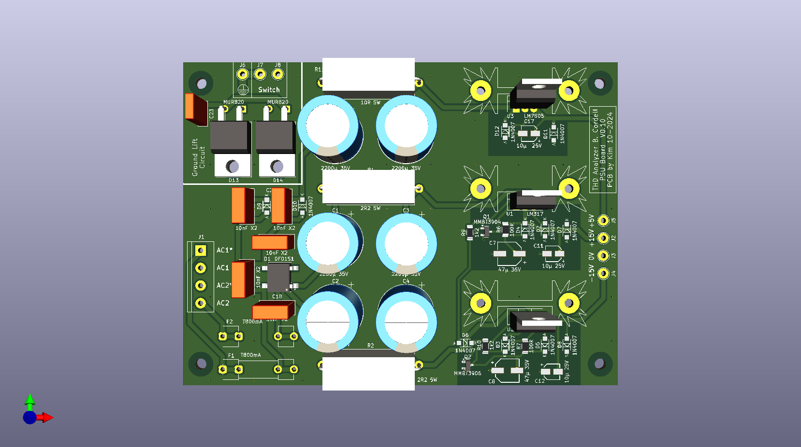

# PCB5 PSU for the THD analyzer
 
*PCB5 3D-view from top layer*
The PCB was created using KiCad v8.0. It is a double sided PCB with most of the components at the top side. SMD components were used whenever is was practical. Heat sinks for the voltage regulators are mounted at the board. They produce some heat, hence the generous spacing between them.

# PCB5 Schemaitc
 
*PCB5 schematic*

# Design-details
The design is a common linear power supply. A full wave rectifier (D1) is used for the +15V and -15V rails. The DC voltage are smoothed by capacitor C1 and C2. The RC filter constituting of R2, C3 (and R2, C4) removes more hum.

Adjustable linear voltage regulators (U1 and U2) are used to provide +15V and -15V. A mutual shut-off circuit consisting of Q1, Q2, D6, R9 and R10. Drops the output voltage to about 1,25V if the other voltage rail would disappear. Saving all the NE5534 ships, which can be damaged if supplied from on rail only.

The +5V supply is provided by the rectifier consisting of D9 and D10, this way the both winding of the transformer are loaded equally. The DC is filter the same way as for +/-15V by C13, C14 and R11. The bigger value of R11 also drop the voltage some more before it is regulated to +5V by U3.

### Perfomance
The PSU was bench tested with following loads;

- 400mA from +15V supply
- 200mA from -15V supply
- 220mA from +5V supply

Noise and hum <5mV
Maximum temperature of heat sinks was 55°C after 1 hour.

# Gerbers
Files

# Construction
Following these orders of construction makes the process much easier.
- Solder all the SMD components to the board.
- Solder all the through hole components, starting with the lowest components first. – Do not mount the voltage regulators or heat sinks yet.
- Mount the voltage regulars at the heat sinks with thermal paste. Insulation between the regulator and heat sink is not needed, nor recommended since heat transfer is better without.
- Solder the heat sinks (with the regulator mounted) to the board first. A small spacer between the heat sink and board is recommended, since there are traces underneath the fins of the heat sinks.
- Lastly solder the legs of the voltage regulators to the board. Soldering the legs after mounting the regulators to the heats sinks minimizes the mechanical stress of the solder joints, thus less chance of failure due to thermal cycling.
